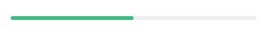
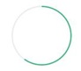

# wx-progress 

> 一个 Weex 的水平，圆形进度条

 [](https://www.npmjs.com/package/wx-progress) [](https://www.npmjs.com/package/wx-progress) [](https://www.npmjs.com/package/wx-progress)
## 使用方法
### 安装
```javascript
npm i wx-progress --save
```

### 水平进度条
```javascript
<wx-progress :percent='50' :wx_width='650'></wx-progress>
```

##### 可配置参数
| Prop | Type | Required | Default | Description |
|-------------|------------|--------|-----|-----|
| percent | `Number` |`Y`| `0` | 百分比`(0-100)` |
| wx-height | `Number` |`N`| `10` | 高度 |
| wx-width | `Number` |`N`| `600` | 长度 |
| wx-color | `String` |`N`| `#42b983` | 颜色 |
| wx-bgColor | `String` |`N`| `#EEEEEE` | 进度底色 |
| wx-radius | `Number` |`N`| `5` | 圆角 |
| duration | `Number` |`N`| `2000` | 动画时长 |

### 环形进度条
```javascript
<wx-c-progress :percent="60" :wx-radius='100'></wx-c-progress>
```

##### 可配置参数
| Prop | Type | Required | Default | Description |
|-------------|------------|--------|-----|-----|
| percent | `Number` |`Y`| `0` | 百分比`(0-100)` |
| wxc-color | `String` |`N`| `#42b983` | 颜色 |
| wxc-bgColor | `String` |`N`| `#EEEEEE` | 进度底色 |
| wxc-radius | `Number` |`N`| `100` | 半径 |
| wxc_stokenWidth | `Number` |`N`| `4` | 环形宽度 |
| duration | `Number` |`N`| `2000` | 动画时长 |


更详细效果可以参考 [demo](demo/index.vue)


